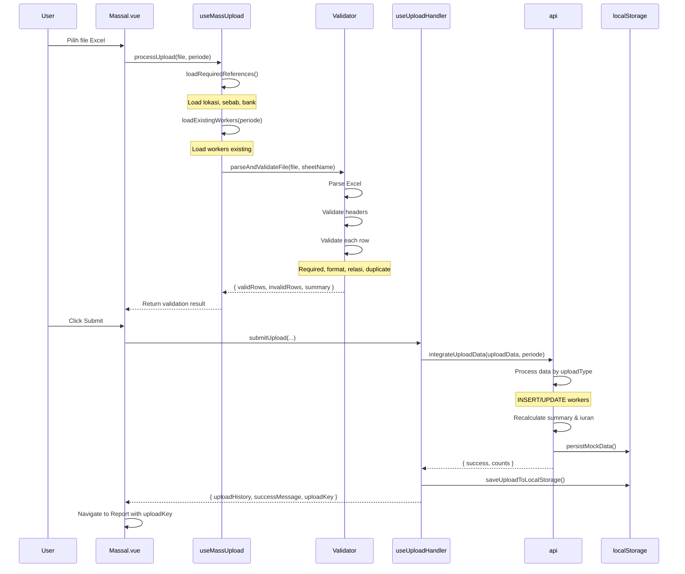
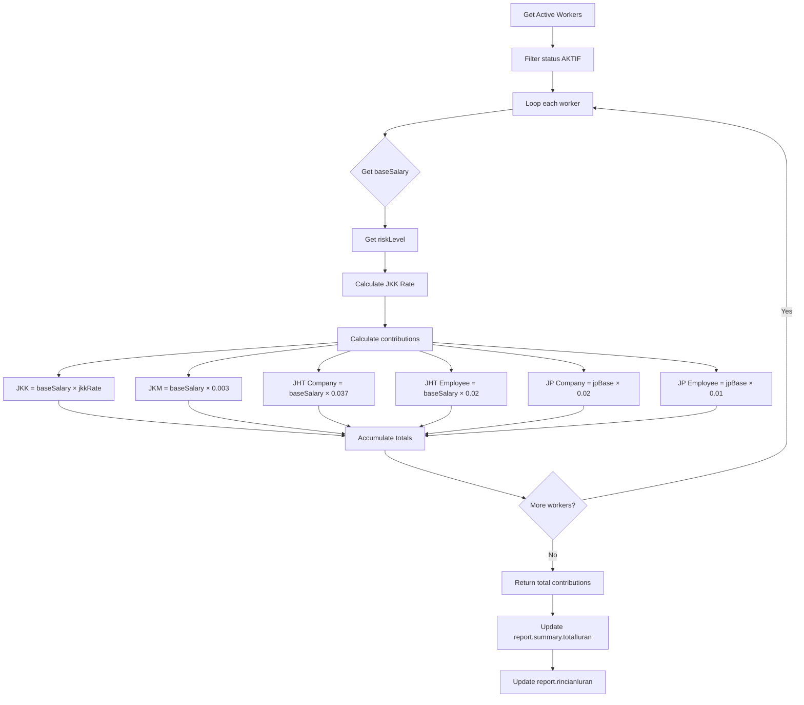

# Penjelasan File JavaScript - Mutasi Data

Dokumen ini menjelaskan fungsionalitas dan cara kerja setiap file JavaScript dalam proyek Mutasi Data.

---

## 📁 Struktur Folder

```
src/
├── main.js                     # Entry point aplikasi
├── router/
│   └── index.js               # Konfigurasi routing
├── services/                  # Layer komunikasi dengan API/data
│   ├── api.js
│   ├── bankService.js
│   ├── locationService.js
│   ├── sebabService.js
│   └── templateService.js
├── utils/                     # Utility functions dan helpers
│   ├── contributionCalculator.js
│   ├── dataTransform.js
│   ├── formatters.js
│   ├── reportExport.js
│   ├── routerHelpers.js
│   └── workerFilters.js
├── composables/              # Vue composables (reusable logic)
│   ├── useMassUpload.js
│   ├── useMassUploadValidator.js
│   ├── usePagination.js
│   ├── useReportData.js
│   ├── useUploadHandler.js
│   └── useUploadHistory.js
└── config/
    └── uploadConfig.js       # Konfigurasi template upload
```

---

## 🚀 Entry Point

### `main.js`
**Lokasi**: `src/main.js`

**Tujuan**: File entry point aplikasi Vue.js yang menginisialisasi aplikasi.

**Fungsi-fungsi**:
1. **Import Dependencies**
   - Mengimpor `createApp` dari Vue 3
   - Mengimpor stylesheet global (`style.css` dan Material Design Icons)
   - Mengimpor komponen root `App.vue` dan router

2. **Inisialisasi Aplikasi**
   ```javascript
   createApp(App)
     .use(router)
     .mount('#app')
   ```
   - Membuat instance aplikasi Vue
   - Mendaftarkan router untuk navigasi
   - Mount aplikasi ke DOM element dengan id `app`

---

## 🧭 Router

### `router/index.js`
**Lokasi**: `src/router/index.js`

**Tujuan**: Mengatur routing dan navigasi aplikasi menggunakan Vue Router.

**Fungsi-fungsi**:

1. **Route Configuration** (Baris 7-13)
   ```javascript
   const routes = [
     { path: '/', redirect: '/dashboard' },
     { path: '/dashboard', component: Dashboard },
     { path: '/report', component: Report },
     { path: '/massal', component: Massal },
     { path: '/workers', component: Workers },
   ]
   ```
   - Mendefinisikan semua rute aplikasi
   - Root `/` redirect ke `/dashboard`
   - Setiap rute terhubung ke komponen Vue yang sesuai

2. **Router Instance** (Baris 15-21)
   ```javascript
   const router = createRouter({
     history: createWebHistory(),
     routes,
     scrollBehavior() {
       return { top: 0 };
     },
   })
   ```
   - Membuat instance router dengan history mode (URL tanpa #)
   - `scrollBehavior`: Mengatur scroll ke top saat navigasi halaman baru

---

## 📡 Services

### `services/api.js`
**Lokasi**: `src/services/api.js`

**Tujuan**: Service utama untuk mengelola data aplikasi. Menangani semua operasi CRUD dan integrasi data. Menggunakan mock data dari `data.json` dengan caching di localStorage.

**Fungsi-fungsi Utama**:

#### 1. **Data Loading & Caching** (Baris 18-59)

- **`loadMockData(forceReload = false)`** (Baris 18-37)
  - Memuat data dari `/mock-api/data.json`
  - Menggunakan cache untuk performa lebih baik
  - Parameter `forceReload`: memaksa reload data dari server
  - Mengembalikan Promise dengan data JSON

- **`loadPersistedData()`** (Baris 39-50)
  - Memuat data yang disimpan di localStorage
  - Validasi data sebelum digunakan
  - Mengembalikan null jika gagal

- **`persistMockData()`** (Baris 52-59)
  - Menyimpan data ke localStorage
  - Error handling jika localStorage penuh/error

#### 2. **ID Generation** (Baris 65-82)

- **`generateIdPegawai()`** (Baris 65-70)
  - Generate ID pegawai otomatis
  - Format: `TK-YYYYMMDD-XXXX` (contoh: `TK-20250115-0001`)
  - Menggunakan timestamp dan random number

- **`generateKodeTk(sequence = null)`** (Baris 76-82)
  - Generate kode TK dengan format `TK-XXXXX`
  - Bisa menggunakan sequence number atau random

#### 3. **Dashboard Operations** (Baris 112-179)

- **`getDashboardSummary()`** (Baris 112-118)
  - Mengambil ringkasan data dashboard
  - Menampilkan total TK, iuran, dll

- **`getDashboardHistory(page, perPage, statusFilter, forceReload)`** (Baris 127-179)
  - Mengambil history laporan dengan pagination
  - Parameter:
    - `page`: Halaman saat ini
    - `perPage`: Jumlah item per halaman
    - `statusFilter`: Filter berdasarkan status ('all', 'DRAFT', 'FINAL')
    - `forceReload`: Reload data dari server
  - Mengembalikan data dengan pagination info
  - Melakukan transformasi data untuk component

#### 4. **Report Operations** (Baris 186-356)

- **`getReportByPeriode(periode, forceReload)`** (Baris 186-264)
  - Mengambil data report berdasarkan periode
  - Konversi format periode (`11/2025` → `2025-11`)
  - Recalculate summary hanya dari workers AKTIF
  - Menghitung ulang rincian iuran

- **`getReportWorkers(periode, page, perPage, search, statusFilter)`** (Baris 275-356)
  - Mengambil data workers dengan pagination dan filter
  - Filter berdasarkan status (Aktif, Nonaktif, Baru)
  - Search berdasarkan nama, NIK, atau KPJ
  - Transform data untuk display

#### 5. **Finalization** (Baris 364-430)

- **`finalizeReport(periode, checklist)`** (Baris 364-430)
  - Finalisasi laporan periode tertentu
  - Validasi checklist harus semua di-check
  - Update status menjadi `FINAL`
  - Update dashboard history
  - Persist data ke localStorage

#### 6. **Report Management** (Baris 436-669)

- **`createNewReport()`** (Baris 436-614)
  - Membuat laporan bulanan baru
  - Menentukan periode berdasarkan history terakhir + 1 bulan
  - Copy workers AKTIF dari bulan sebelumnya
  - Reset rapel = 0 untuk bulan baru
  - Copy pengaturan riskLevel dan useTotalUpahForContribution

- **`deleteReport(periode)`** (Baris 620-669)
  - Menghapus laporan berdasarkan periode
  - Update pagination metadata
  - Hapus data report terkait
  - Update currentPeriod jika terhapus

#### 7. **Worker Management** (Baris 677-817)

- **`addWorkerToReport(periode, workerPayload)`** (Baris 677-817)
  - Menambah tenaga kerja ke laporan periode
  - Generate nomor urut otomatis
  - Update summary dan rincian iuran
  - Reset finalisasi ke DRAFT

#### 8. **Upload Integration** (Baris 920-1353)

- **`integrateUploadData(uploadData, periode)`** (Baris 920-1353)
  - Mengintegrasikan data upload ke mock data
  - Mendukung berbagai jenis upload:
    - **TK Massal** (Mendaftar & Lanjutan): INSERT data baru
    - **TK Nonaktif**: UPDATE status → NONAKTIF
    - **Upah Massal**: UPDATE upah dan rapel
    - **Koreksi Massal**: UPDATE data worker yang ada
  - Recalculate summary dan iuran
  - Update dashboard history
  - Persist data

**Cara Kerja Integrasi Upload**:
- **TK Mendaftar**: Mencari berdasarkan NIK/KPJ, jika tidak ada insert baru
- **TK Lanjutan**: Update TK tanpa KPJ dengan data yang punya KPJ
- **TK Nonaktif**: Cari berdasarkan KPJ, update status dan log history
- **Upah Massal**: Cari berdasarkan KPJ/NIK/NO_PEGAWAI, update upah
- **Koreksi**: Cari berdasarkan KODE, update field yang diizinkan

#### 9. **Worker Options** (Baris 823-831)

- **`getWorkerOptions()`** (Baris 823-831)
  - Mengambil opsi untuk dropdown form worker

#### 10. **Workers List** (Baris 838-856)

- **`getWorkers(filters)`** (Baris 838-856)
  - Mengambil list workers dengan filter
  - Filter berdasarkan status dan kategori

---

### `services/bankService.js`
**Lokasi**: `src/services/bankService.js`

**Tujuan**: Service untuk memuat dan memvalidasi referensi bank.

**Fungsi-fungsi**:

1. **`fetchBanks()`** (Baris 9-16)
   - Fetch data bank dari `/mock-api/bank.json`
   - Mengembalikan array objek bank dengan struktur:
     ```javascript
     { nama_bank: string, kode_bank: string }
     ```

2. **`buildBankMap(banks)`** (Baris 23-36)
   - Membuat map untuk lookup cepat bank
   - Index berdasarkan `nama_bank` dan `kode_bank` (normalized)
   - Contoh: `map['BRI'] = { nama_bank: 'BRI', kode_bank: '002' }`

3. **`validateBankMatch(namaBank, kodeBank, banks)`** (Baris 45-61)
   - Validasi apakah nama bank dan kode bank sesuai
   - Normalisasi string untuk case-insensitive comparison
   - Return `true` jika match, `false` jika tidak

4. **`normalizeString(value)`** (Baris 63-66)
   - Helper untuk normalisasi string
   - Trim dan uppercase

---

### `services/locationService.js`
**Lokasi**: `src/services/locationService.js`

**Tujuan**: Service untuk memuat referensi lokasi pekerjaan.

**Fungsi-fungsi**:

1. **`fetchLocations()`** (Baris 9-16)
   - Fetch data lokasi dari `/mock-api/lokasi.json`
   - Mengembalikan array objek lokasi:
     ```javascript
     { nama: string, kode: string }
     ```

2. **`buildLokasiMap(locations)`** (Baris 23-36)
   - Membuat map untuk lookup cepat lokasi
   - Index berdasarkan `nama` dan `kode` (normalized)

3. **`normalizeString(value)`** (Baris 38-41)
   - Helper untuk normalisasi string

---

### `services/sebabService.js`
**Lokasi**: `src/services/sebabService.js`

**Tujuan**: Service untuk memuat referensi sebab nonaktif (alasan TK dinonaktifkan).

**Fungsi-fungsi**:

1. **`fetchSebab()`** (Baris 9-16)
   - Fetch data sebab nonaktif dari `/mock-api/sebab.json`
   - Mengembalikan array objek sebab:
     ```javascript
     { sebab_na: string, kode_na: string }
     ```

2. **`buildSebabMap(sebabList)`** (Baris 23-36)
   - Membuat map untuk lookup cepat sebab
   - Index berdasarkan `sebab_na` dan `kode_na`

3. **`normalizeString(value)`** (Baris 38-41)
   - Helper untuk normalisasi string

---

### `services/templateService.js`
**Lokasi**: `src/services/templateService.js`

**Tujuan**: Service untuk mengunduh file template upload.

**Fungsi-fungsi**:

1. **`downloadTemplateFile(templateFileName)`** (Baris 9-30)
   - Download file template dari `/templates/`
   - Validasi nama file
   - Fetch file sebagai blob
   - Trigger browser download menggunakan `<a>` element
   - Cleanup URL object setelah download
   
**Cara Kerja**:
   ```javascript
   // 1. Fetch file
   const response = await fetch(`/templates/${templateFileName}`);
   const blob = await response.blob();
   
   // 2. Create download link
   const url = window.URL.createObjectURL(blob);
   const link = document.createElement("a");
   link.href = url;
   link.download = templateFileName;
   
   // 3. Trigger download
   link.click();
   
   // 4. Cleanup
   window.URL.revokeObjectURL(url);
   ```

---

## 🛠️ Utils

### `utils/contributionCalculator.js`
**Lokasi**: `src/utils/contributionCalculator.js`

**Tujuan**: Menghitung iuran BPJS Ketenagakerjaan (JKK, JKM, JHT, JP) berdasarkan upah dan risk level.

**Konstanta** (Baris 1-16):
```javascript
RISK_LEVEL_TARIFFS = {
  "Sangat Rendah": 0.0024,
  "Rendah": 0.0054,
  "Sedang": 0.0089,
  "Tinggi": 0.0127,
  "Sangat Tinggi": 0.0174,
}
JKM_RATE = 0.003           // 0.3%
JHT_COMPANY_RATE = 0.037   // 3.7%
JHT_EMPLOYEE_RATE = 0.02   // 2%
JP_COMPANY_RATE = 0.02     // 2%
JP_EMPLOYEE_RATE = 0.01    // 1%
DEFAULT_JP_SALARY_CAP = 9_810_000
```

**Fungsi-fungsi**:

1. **`normalizeNumber(value)`** (Baris 18-24)
   - Konversi value ke number yang valid
   - Return 0 jika NaN atau negatif

2. **`getJkkRate(riskLevel)`** (Baris 26-38)
   - Mendapatkan tarif JKK berdasarkan risk level
   - Normalisasi risk level (capitalize first letter)
   - Default: "Rendah" (0.54%)

3. **`calculateWorkerContribution({ baseSalary, totalSalary, riskLevel, jpSalaryCap })`** (Baris 40-97)
   - Menghitung iuran untuk satu worker
   - Parameter:
     - `baseSalary`: Upah pokok (basis perhitungan)
     - `totalSalary`: Total upah (upah pokok + rapel)
     - `riskLevel`: Tingkat risiko pekerjaan
     - `jpSalaryCap`: Batas maksimal gaji untuk JP (default: 9.810.000)
   
   - **Perhitungan**:
     ```javascript
     JKK (Perusahaan) = baseSalary × JKK_RATE
     JKM (Perusahaan) = baseSalary × 0.003
     JHT (Perusahaan) = baseSalary × 0.037
     JHT (Karyawan)   = baseSalary × 0.02
     JP (Perusahaan)  = jpBase × 0.02
     JP (Karyawan)    = jpBase × 0.01
     ```
     (dimana `jpBase = Math.min(baseSalary, jpSalaryCap)`)
   
   - Mengembalikan object berisi:
     - `riskLevel`: Risk level yang digunakan
     - `salaryBase`, `salaryTotal`, `jpBase`
     - `rates`: Semua tarif yang digunakan
     - `breakdown`: Detail iuran per program (company & employee)
     - `totals`: Total iuran (overall, company, employee)

4. **`calculateTotalContributions(workers, options)`** (Baris 99-139)
   - Menghitung total iuran dari array workers
   - Parameter:
     - `workers`: Array worker objects
     - `options`: Konfigurasi (defaultRiskLevel, jpSalaryCap, accessor functions)
   
   - Menggunakan `reduce` untuk akumulasi iuran semua workers
   - Mengembalikan object dengan struktur:
     ```javascript
     {
       company: { jkk, jkm, jht, jp, total },
       employee: { jht, jp, total },
       totals: { overall, company, employee }
     }
     ```

---

### `utils/dataTransform.js`
**Lokasi**: `src/utils/dataTransform.js`

**Tujuan**: Helper functions untuk transformasi data dari format JSON backend ke format yang dibutuhkan component.

**Fungsi-fungsi**:

1. **`transformActions(jsonActions)`** (Baris 11-21)
   - Transform actions dari uppercase ke capitalize
   - Mapping:
     ```javascript
     "EDIT" → "Edit"
     "CETAK" → "Cetak"
     "HAPUS" → "Hapus"
     "BATAL" → "Batal"
     "LIHAT" → "Lihat"
     ```

2. **`transformWorkerStatus(status)`** (Baris 28-34)
   - Transform status worker dari uppercase ke capitalize
   - `"AKTIF"` → `"Aktif"`
   - `"NONAKTIF"` → `"Nonaktif"`

3. **`transformJenisKelamin(jk)`** (Baris 41-61)
   - Transform jenis kelamin dari berbagai format ke format standar
   - Input yang diterima:
     - `"L"`, `"LAKI-LAKI"`, `"Laki-laki"` → `"Laki-laki"`
     - `"P"`, `"PEREMPUAN"`, `"Perempuan"` → `"Perempuan"`
   - Default: `"Laki-laki"`

4. **`transformHistoryItem(item)`** (Baris 68-84)
   - Transform history item untuk dashboard
   - Menambahkan field `periodeRaw` untuk referensi
   - Transform actions menggunakan `transformActions()`
   - Keep original data di field `original`

5. **`transformWorker(worker)`** (Baris 91-105)
   - Transform worker data untuk component
   - Transform jenis kelamin dan status
   - Keep original data di field `original`

6. **`convertPeriodeToKey(periode)`** (Baris 112-118)
   - Convert periode dari display format ke key format
   - `"11/2025"` → `"2025-11"`
   - Jika sudah dalam format key, return as-is

7. **`convertPeriodeToDisplay(periodeKey)`** (Baris 125-131)
   - Convert periode dari key format ke display format
   - `"2025-11"` → `"11/2025"`
   - Jika sudah dalam format display, return as-is

---

### `utils/formatters.js`
**Lokasi**: `src/utils/formatters.js`

**Tujuan**: Helper functions untuk formatting data.

**Fungsi-fungsi**:

1. **`formatCurrency(value)`** (Baris 11-17)
   - Format angka ke format Rupiah Indonesia
   - Menggunakan `Intl.NumberFormat` dengan locale `id-ID`
   - Contoh: `1000000` → `"Rp 1.000.000"`
   - Tidak menampilkan desimal (minimumFractionDigits: 0)

---

### `utils/reportExport.js`
**Lokasi**: `src/utils/reportExport.js`

**Tujuan**: Utility untuk export laporan ke print preview dan Excel.

**Fungsi-fungsi**:

1. **`ensureClientEnvironment()`** (Baris 4-8)
   - Validasi bahwa kode berjalan di browser (bukan server-side)
   - Throw error jika `window` undefined

2. **`openReportPrintPreview(report, periodeLabel)`** (Baris 10-110)
   - Membuka print preview laporan dalam window baru
   - Parameter:
     - `report`: Data laporan
     - `periodeLabel`: Label periode untuk header
   
   - **Cara Kerja**:
     1. Generate HTML tabel dari workers data
     2. Tambahkan summary cards (total TK, upah, iuran, denda)
     3. Buka window baru dengan `window.open()`
     4. Write HTML ke window baru
     5. Trigger browser print dialog dengan `window.print()`
   
   - **Styling**: Inline CSS untuk tabel, cards, dan layout

3. **`downloadReportWorkbook(report, filename)`** (Baris 112-151)
   - Download laporan sebagai file Excel (.xlsx)
   - Parameter:
     - `report`: Data laporan
     - `filename`: Nama file (default: "laporan-mutasi.xlsx")
   
   - **Cara Kerja**:
     1. Buat workbook baru menggunakan XLSX library
     2. Buat sheet "Ringkasan" dengan summary data
     3. Buat sheet "Tenaga Kerja" dengan data workers
     4. Convert data ke sheet menggunakan `XLSX.utils.json_to_sheet()`
     5. Append sheets ke workbook
     6. Trigger download dengan `XLSX.writeFile()`

---

### `utils/routerHelpers.js`
**Lokasi**: `src/utils/routerHelpers.js`

**Tujuan**: Helper functions untuk navigasi router dengan periode.

**Fungsi-fungsi**:

1. **`navigateToReport(router, periode, additionalQuery)`** (Baris 12-18)
   - Navigate ke halaman report dengan query parameter periode
   - Parameter:
     - `router`: Vue router instance
     - `periode`: Periode dalam format "11/2025"
     - `additionalQuery`: Query parameters tambahan
   
   - Contoh: `navigateToReport(router, "11/2025", { tab: "summary" })`
   - Hasil: `/report?periode=11/2025&tab=summary`

2. **`navigateToMassal(router, uploadType, periode)`** (Baris 26-32)
   - Navigate ke halaman massal upload
   - Parameter:
     - `uploadType`: Jenis upload (tk-massal, koreksi-massal, dll)
     - `periode`: Periode (optional)
   
   - Contoh: `navigateToMassal(router, "tk-massal", "11/2025")`
   - Hasil: `/massal?type=tk-massal&periode=11/2025`

3. **`navigateToWorkers(router, periode)`** (Baris 39-45)
   - Navigate ke halaman workers
   - Contoh: `navigateToWorkers(router, "11/2025")`
   - Hasil: `/workers?periode=11/2025`

4. **`getPeriodeFromRoute(route, fallback)`** (Baris 53-55)
   - Get periode dari route query atau fallback value
   - Contoh: `getPeriodeFromRoute(route, "11/2025")`
   - Return periode dari query atau fallback jika tidak ada

---

### `utils/workerFilters.js`
**Lokasi**: `src/utils/workerFilters.js`

**Tujuan**: Helper functions untuk filter workers berdasarkan status.

**Fungsi-fungsi**:

1. **`filterActiveWorkers(workers)`** (Baris 11-13)
   - Filter hanya workers dengan status "AKTIF"
   - Menggunakan `Array.filter()`
   - Contoh:
     ```javascript
     const allWorkers = [
       { nama: "John", status: "AKTIF" },
       { nama: "Jane", status: "NONAKTIF" }
     ]
     filterActiveWorkers(allWorkers) // → [{ nama: "John", status: "AKTIF" }]
     ```

2. **`isActiveWorker(worker)`** (Baris 20-22)
   - Check apakah worker aktif
   - Return `true` jika status "AKTIF", `false` jika tidak

---

## 🎨 Composables

### `composables/useMassUpload.js`
**Lokasi**: `src/composables/useMassUpload.js`

**Tujuan**: Composable untuk mengelola upload massal. Menangani logika upload, validasi, dan integrasi data.

**State** (Baris 16-32):
```javascript
selectedFile         // File yang dipilih user
validationSummary    // Ringkasan hasil validasi
invalidRows          // Baris yang invalid
validRows            // Baris yang valid
isProcessingUpload   // Loading state saat proses
isUploading          // Loading state saat upload
lokasiOptions        // Opsi lokasi
lokasiMap            // Map lokasi untuk lookup
sebabOptions         // Opsi sebab nonaktif
sebabMap             // Map sebab untuk lookup
bankOptions          // Opsi bank
bankMap              // Map bank untuk lookup
existingWorkers      // Workers yang sudah ada (untuk validasi)
```

**Fungsi-fungsi**:

1. **`loadExistingWorkers(periode)`** (Baris 40-65)
   - Load workers yang sudah ada dari periode tertentu
   - Digunakan untuk validasi duplicate dan relasi
   - Jika tidak ada periode, ambil semua workers AKTIF

2. **`getExistingWorkerByNik(nik)`** (Baris 68-73)
   - Cari existing worker berdasarkan NIK
   - Return worker atau null

3. **`getExistingWorkerByKpj(kpj)`** (Baris 75-80)
   - Cari existing worker berdasarkan KPJ

4. **`getExistingWorkerByKode(kode)`** (Baris 82-92)
   - Cari existing worker berdasarkan KODE (ID_PEGAWAI, KODE_TK, noPegawai, KPJ, atau NIK)

5. **`getValidatorConfig()`** (Baris 95-128)
   - Generate konfigurasi untuk validator
   - Menentukan mode berdasarkan uploadType dan subType
   - Return config dengan template headers, required fields, dan lookup functions

6. **`loadLokasiData()`** (Baris 131-139)
   - Load data lokasi dari service
   - Build map untuk lookup cepat

7. **`loadSebabData()`** (Baris 141-149)
   - Load data sebab nonaktif (untuk upload TK Nonaktif)

8. **`loadBankData()`** (Baris 151-159)
   - Load data bank (untuk upload Koreksi Massal)

9. **`loadRequiredReferences()`** (Baris 162-172)
   - Load semua referensi yang diperlukan berdasarkan upload type

10. **`getSheetName()`** (Baris 175-186)
    - Get nama sheet Excel yang harus divalidasi
    - Mapping:
      - Koreksi Massal → "update_data_tk"
      - Upah Massal → "data_upah"
      - TK Nonaktif → "data_tk_na"
      - TK Lanjutan → "data_tk_lanjutan"
      - TK Mendaftar → "data_tk_baru" (default)

11. **`processUpload(file, periode)`** (Baris 189-219)
    - Proses file upload dan validasi
    - Langkah:
      1. Load referensi data (lokasi, sebab, bank)
      2. Load existing workers
      3. Parse dan validate file menggunakan validator
      4. Update state (validationSummary, invalidRows, validRows)
    - Return hasil validasi

12. **`resetValidation()`** (Baris 222-226)
    - Reset state validasi

13. **`resetFile()`** (Baris 229-232)
    - Reset file selection dan validasi

---

### `composables/useMassUploadValidator.js`
**Lokasi**: `src/composables/useMassUploadValidator.js`

**Tujuan**: Composable untuk mem-parse dan memvalidasi file upload massal (Excel).

**Konstanta** (Baris 1-44):
```javascript
ALLOWED_FIELDS_MENDAFTAR  // Field yang boleh di-upload untuk TK Mendaftar
ALLOWED_FIELDS_KOREKSI    // Field yang boleh diupdate untuk Koreksi
ALLOWED_FIELDS_UPAH       // Field yang boleh diupdate untuk Upah
REFERENCE_FIELDS_UPAH     // Field referensi untuk Upah (tidak di-update)
```

**Fungsi-fungsi**:

1. **`parseAndValidateFile(file, sheetName)`** (Baris 63-254)
   - Parse file Excel dan validasi setiap row
   - Parameter:
     - `file`: File Excel
     - `sheetName`: Nama sheet yang harus di-parse
   
   - **Langkah**:
     1. Read file menggunakan XLSX library
     2. Find sheet berdasarkan nama
     3. Convert sheet ke JSON
     4. Validasi header sesuai template
     5. Validasi setiap row
     6. Detect duplicate dalam file
     7. Generate summary
   
   - Return:
     ```javascript
     {
       validRows: [],           // Baris yang valid
       invalidRows: [],         // Baris yang invalid dengan error
       summary: {
         totalRows,
         validCount,
         invalidCount
       }
     }
     ```

2. **`validateDuplicateInFile(validRows, invalidRows)`** (Baris 256-305)
   - Validasi duplicate data dalam file yang sama
   - Deteksi berdasarkan:
     - NIK (untuk TK Mendaftar/Lanjutan)
     - KPJ (untuk TK Nonaktif/Upah)
     - KODE (untuk Koreksi)
   - Jika ada duplicate, pindahkan ke invalidRows

3. **`validateRow(row, columnAliases, normalizedHeader)`** (Baris 307-835)
   - Validasi satu row data
   - Validasi yang dilakukan:
     - **Required fields**: Semua field wajib harus diisi
     - **Format tanggal**: Tanggal harus valid
     - **Lokasi pekerjaan**: Harus ada di referensi
     - **Sebab nonaktif**: Harus ada di referensi (untuk TK Nonaktif)
     - **Bank**: Nama dan kode bank harus match (untuk Koreksi)
     - **Relasi data**: 
       - TK Lanjutan: KPJ harus sudah ada
       - TK Nonaktif: KPJ harus sudah ada dan status AKTIF
       - Upah: Worker harus sudah ada
       - Koreksi: Worker harus sudah ada
     - **Duplicate**: NIK/KPJ tidak boleh duplicate dengan existing data
   
   - Return:
     ```javascript
     {
       isValid: boolean,
       row: { ...normalizedData },
       errors: ["error 1", "error 2"]
     }
     ```

4. **`parseDateValue(value)`** (Baris 837-848)
   - Parse tanggal dari berbagai format Excel
   - Support:
     - Excel serial date (numeric)
     - String date (ISO format, slash format)
   - Return tanggal dalam format `YYYY-MM-DD`

5. **`normalizeIdentifierValue(value)`** (Baris 850-856)
   - Normalisasi nilai identifier (NIK, KPJ, dll)
   - Trim whitespace
   - Convert ke string

6. **`normalizeString(value)`** (Baris 858-861)
   - Normalisasi string (trim dan uppercase)

---

### `composables/usePagination.js`
**Lokasi**: `src/composables/usePagination.js`

**Tujuan**: Composable reusable untuk pagination logic.

**Parameter** (Baris 16-21):
```javascript
{
  loadDataFunction,      // Function untuk load data saat page berubah
  initialPage,           // Halaman awal (default: 1)
  initialTotalPages,     // Total halaman awal (default: 1)
}
```

**State**:
```javascript
currentPage     // Halaman saat ini
totalPages      // Total halaman
```

**Fungsi-fungsi**:

1. **`handlePrevPage()`** (Baris 26-33)
   - Navigate ke halaman sebelumnya
   - Validasi: currentPage > 1
   - Call loadDataFunction jika ada

2. **`handleNextPage()`** (Baris 35-42)
   - Navigate ke halaman selanjutnya
   - Validasi: currentPage < totalPages
   - Call loadDataFunction jika ada

**Usage**:
```javascript
const { currentPage, totalPages, handlePrevPage, handleNextPage } = 
  usePagination({
    loadDataFunction: loadWorkersData,
    initialPage: 1,
    initialTotalPages: 10
  })
```

---

### `composables/useReportData.js`
**Lokasi**: `src/composables/useReportData.js`

**Tujuan**: Composable untuk mengelola data report dan upload notification.

**State** (Baris 9-26):
```javascript
showNewUploadNotification   // Show/hide notifikasi upload baru
newUploadData               // Data upload terbaru
summary                     // Summary report
rincianIuran                // Rincian iuran per program
finalisasi                  // Data finalisasi (checklist)
```

**Fungsi-fungsi**:

1. **`loadNewUploadData(route, employeeRowsRaw, editSummaryData, statusFilter, searchQuery)`** (Baris 36-172)
   - Load data upload terbaru dari localStorage
   - Update employeeRowsRaw berdasarkan actionType:
     - **INSERT** (TK Massal): Tambahkan data baru
     - **UPDATE_STATUS** (TK Nonaktif): Update status worker menjadi NONAKTIF
     - **UPDATE_UPAH** (Upah Massal): Update upah dan rapel
     - **UPDATE_DATA** (Koreksi): Update field yang diizinkan
   
   - Transform data upload ke format worker
   - Merge dengan data existing
   - Update summary (total TK, upah)
   
   - **Cara Kerja**:
     1. Ambil uploadKey dari route query
     2. Load recentUploads dari localStorage
     3. Find upload data berdasarkan key
     4. Transform dan merge data
     5. Update summary

**Usage**:
```javascript
const { 
  showNewUploadNotification, 
  newUploadData, 
  summary, 
  rincianIuran, 
  finalisasi,
  loadNewUploadData 
} = useReportData()

// Load data saat component mounted
loadNewUploadData(route, employeeRowsRaw, editSummaryData)
```

---

### `composables/useUploadHandler.js`
**Lokasi**: `src/composables/useUploadHandler.js`

**Tujuan**: Composable untuk menangani proses upload dan integrasi data.

**State** (Baris 9-10):
```javascript
isUploading        // Loading state saat upload
recentUploadKey    // Key upload terbaru
```

**Fungsi-fungsi**:

1. **`getUploadConfig(uploadType, subType)`** (Baris 15-42)
   - Get konfigurasi upload berdasarkan type
   - Return config:
     ```javascript
     {
       apiEndpoint,        // URL API endpoint
       actionType,         // INSERT, UPDATE_STATUS, UPDATE_UPAH, UPDATE_DATA
       successMessage      // Function untuk generate success message
     }
     ```

2. **`submitUpload(uploadType, subType, validRows, getUploadJenisLabel, periode)`** (Baris 47-125)
   - Submit data upload yang valid
   - Langkah:
     1. Validate data
     2. Get config berdasarkan uploadType
     3. **Integrate data** ke mock data menggunakan `api.integrateUploadData()`
     4. Simulasi delay (500ms)
     5. Save ke localStorage
     6. Create upload history entry
     7. Return success result dengan uploadKey
   
   - Return:
     ```javascript
     {
       uploadHistory,      // Entry untuk tabel history
       successMessage,     // Message sukses
       uploadKey           // Key untuk redirect
     }
     ```

3. **`saveUploadToLocalStorage(key, uploadData)`** (Baris 130-142)
   - Save upload data ke localStorage
   - Simpan maksimal 5 upload terakhir
   - Key: `recentUploads`

**Usage**:
```javascript
const { isUploading, submitUpload } = useUploadHandler()

async function handleSubmit() {
  const result = await submitUpload(
    'tk-massal',
    'mendaftar',
    validRows,
    () => 'TK Mendaftar',
    '11/2025'
  )
  
  // Redirect dengan uploadKey
  router.push({
    path: '/report',
    query: { 
      periode: '11/2025',
      uploadKey: result.uploadKey
    }
  })
}
```

---

### `composables/useUploadHistory.js`
**Lokasi**: `src/composables/useUploadHistory.js`

**Tujuan**: Composable untuk mengelola history upload.

**Konstanta** (Baris 7-30):
```javascript
HISTORY_STORAGE_KEY = "massalUploadHistory"

defaultUploadHistory = [
  {
    totalValid: 150,
    totalInvalid: 5,
    totalData: 155,
    statusValidasi: "Selesai",
    tanggalSelesai: "2025-01-15 10:30:00",
    sumberData: "File Upload",
    jenis: "TK Mendaftar",
    action: "download"
  },
  ...
]
```

**State** (Baris 33-50):
```javascript
uploadHistory          // Array history upload
historyTableHeaders    // Header tabel history
historyTableData       // Data tabel history (computed)
```

**Fungsi-fungsi**:

1. **`loadHistoryFromStorage()`** (Baris 72-83)
   - Load history dari localStorage
   - Validasi data (harus array)
   - Return null jika error

2. **`saveHistoryToStorage(history)`** (Baris 85-95)
   - Save history ke localStorage
   - Stringify array ke JSON

3. **`addHistoryEntry(entry)`** (Baris 67-70)
   - Tambah entry baru ke history
   - Prepend (unshift) agar yang terbaru di atas
   - Auto-save ke localStorage

4. **`historyTableData`** (Computed, Baris 53-64)
   - Transform uploadHistory ke format tabel
   - Lowercase keys untuk template

**Usage**:
```javascript
const { 
  uploadHistory, 
  historyTableHeaders, 
  historyTableData,
  addHistoryEntry 
} = useUploadHistory()

// Tambah history baru
addHistoryEntry({
  totalValid: 100,
  totalInvalid: 2,
  totalData: 102,
  statusValidasi: "Selesai",
  tanggalSelesai: new Date().toISOString(),
  sumberData: "File Upload",
  jenis: "TK Mendaftar",
  action: "download"
})
```

---

## ⚙️ Config

### `config/uploadConfig.js`
**Lokasi**: `src/config/uploadConfig.js`

**Tujuan**: Konfigurasi untuk semua jenis upload massal (template headers, required fields, date fields).

**Konfigurasi Template**:

1. **TK Mendaftar** (Baris 7-50)
   ```javascript
   templateHeadersMendaftar = [
     "NO_PEGAWAI", "NAMA_LENGKAP", "GELAR", 
     "TELEPON_AREA_RUMAH", "TELEPON_RUMAH", ...
   ]
   
   requiredFieldsMendaftar = [
     "NAMA_LENGKAP", "NOMOR_IDENTITAS", "TANGGAL_LAHIR",
     "JENIS_KELAMIN", "STATUS_KAWIN", "STATUS_PEGAWAI",
     "UPAH", "LOKASI_PEKERJAAN", "TGL_AWAL_BEKERJA"
   ]
   ```

2. **TK Lanjutan** (Baris 52-73)
   ```javascript
   templateHeadersLanjutan = [
     "NOMOR_IDENTITAS_KPJ", "NO_PEGAWAI", "NAMA_LENGKAP",
     "TGL_LAHIR", "UPAH", "LOKASI_PEKERJAAN", ...
   ]
   
   requiredFieldsLanjutan = [
     "NOMOR_IDENTITAS_KPJ", "NAMA_LENGKAP", "TGL_LAHIR",
     "UPAH", "LOKASI_PEKERJAAN", "STATUS_PEGAWAI",
     "TGL_AWAL_BEKERJA"
   ]
   ```

3. **TK Nonaktif** (Baris 75-91)
   ```javascript
   templateHeadersNonaktif = [
     "KPJ", "NAMA_LENGKAP", "TGL_LAHIR",
     "SEBAB_NA", "TGL_KEJADIAN", "KETERANGAN"
   ]
   
   requiredFieldsNonaktif = [
     "KPJ", "NAMA_LENGKAP", "TGL_LAHIR",
     "SEBAB_NA", "TGL_KEJADIAN"
   ]
   ```

4. **Upah Massal** (Baris 93-115)
   ```javascript
   templateHeadersUpah = [
     "NIK", "NO_PEGAWAI", "KPJ", "KODE_TK",
     "NAMA_LENGKAP", "TGL_LAHIR",
     "UPAH", "RAPEL", "BLTH", "NPP"
   ]
   
   requiredFieldsUpah = [
     "NIK", "NAMA_LENGKAP", "TGL_LAHIR",
     "UPAH", "RAPEL", "BLTH"
   ]
   ```

5. **Koreksi Data** (Baris 117-136)
   ```javascript
   templateHeadersKoreksi = [
     "KODE",
     "ALAMAT_LENGKAP_DOMISILI",
     "HANDPHONE", "LOKASI_PEKERJAAN", "EMAIL",
     "NAMA_BANK", "KODE_BANK",
     "NOMOR_REKENING", "NAMA_REKENING",
     // Optional reference fields
     "NOMOR_PEGAWAI", "ID_PEGAWAI"
   ]
   
   requiredFieldsKoreksi = ["KODE"]
   ```

6. **Date Fields** (Baris 139-147)
   ```javascript
   dateFields = [
     "TANGGAL_LAHIR", "TGL_LAHIR",
     "MASA_LAKU_IDENTITAS", "TANGGAL_KEPESERTAAN",
     "TGL_AWAL_BEKERJA", "TGL_AKHIR_KONTRAK",
     "TGL_KEJADIAN"
   ]
   ```

**Upload Types** (Baris 150-220):
```javascript
uploadTypes = [
  {
    id: "tk-massal",
    title: "Upload Tenaga Kerja Massal",
    subtitle: "Upload data tenaga kerja baru secara massal",
    type: "TK Massal",
    icon: "👥",
    templateFile: "template_tk_baru.xlsx",
    templateLanjutanFile: "template_tk_lanjutan.xlsx",
    instructions: [...],
    showHistory: true
  },
  {
    id: "koreksi-massal",
    title: "Koreksi Data Tenaga Kerja",
    ...
  },
  {
    id: "tk-nonaktif",
    title: "Upload Tenaga Kerja Nonaktif",
    ...
  },
  {
    id: "upah-massal",
    title: "Upload Upah Massal",
    ...
  }
]
```

**Fungsi**:

1. **`getTemplateConfig(uploadType, subType)`** (Baris 225-264)
   - Get konfigurasi template berdasarkan upload type
   - Parameter:
     - `uploadType`: "tk-massal", "koreksi-massal", "upah-massal", "tk-nonaktif"
     - `subType`: "mendaftar" atau "lanjutan" (untuk tk-massal)
   
   - Return:
     ```javascript
     {
       headers: [...templateHeaders],
       requiredFields: [...requiredFields],
       dateFields: [...dateFields]
     }
     ```

---

## 📊 Diagram Alur

### Alur Upload Data



### Alur Perhitungan Iuran



---

## 🔑 Konsep Penting

### 1. **Mock Data & Caching**
- Data disimpan di `data.json` (mock API)
- Cache di localStorage untuk performa
- `persistMockData()` untuk save perubahan
- `forceReload` untuk refresh data

### 2. **Periode Format**
- **Display**: `"11/2025"` (untuk UI)
- **Key**: `"2025-11"` (untuk data storage)
- Konversi menggunakan `convertPeriodeToKey()` dan `convertPeriodeToDisplay()`

### 3. **Status Worker**
- **AKTIF**: Worker aktif, dihitung dalam summary dan iuran
- **NONAKTIF**: Worker nonaktif, tidak dihitung
- **Baru**: Worker tanpa KPJ (filter di UI)

### 4. **Upload Types**
- **TK Mendaftar**: INSERT worker baru tanpa KPJ
- **TK Lanjutan**: INSERT/UPDATE worker dengan KPJ
- **TK Nonaktif**: UPDATE status → NONAKTIF
- **Upah Massal**: UPDATE upah dan rapel
- **Koreksi**: UPDATE field tertentu (alamat, bank, dll)

### 5. **Validasi Upload**
- **Template validation**: Header harus sesuai
- **Required fields**: Field wajib harus diisi
- **Format validation**: Tanggal, angka harus valid
- **Referensi validation**: Lokasi, sebab, bank harus ada
- **Relasi validation**: KPJ/NIK harus exist (untuk update)
- **Duplicate validation**: Tidak boleh duplicate dalam file dan dengan data existing

### 6. **Perhitungan Iuran**
- Berdasarkan upah pokok (baseSalary)
- Risk level menentukan tarif JKK
- JP dibatasi maksimal Rp 9.810.000
- Hanya workers AKTIF yang dihitung

### 7. **Composables Pattern**
- Reusable logic extracted ke composables
- State management menggunakan `ref()` dan `computed()`
- Return object dengan state dan methods
- Import dan gunakan di component

---

## 💡 Tips Penggunaan

1. **Debugging**
   - Gunakan `console.log()` di service/composable
   - Check localStorage di DevTools (Application tab)
   - Lihat network request di Network tab

2. **Development**
   - Gunakan `api.clearCache()` untuk reset data
   - Test validasi dengan berbagai format Excel
   - Test edge cases (duplicate, invalid format, dll)

3. **Maintenance**
   - Update template headers di `uploadConfig.js`
   - Update validation rules di `useMassUploadValidator.js`
   - Update tarif iuran di `contributionCalculator.js`

---

## 📚 Referensi

- **Vue 3**: https://vuejs.org/
- **Vue Router**: https://router.vuejs.org/
- **SheetJS (XLSX)**: https://sheetjs.com/
- **BPJS Ketenagakerjaan**: https://www.bpjsketenagakerjaan.go.id/

---

**Dibuat pada**: ${new Date().toLocaleDateString('id-ID')}
**Versi**: 1.0
